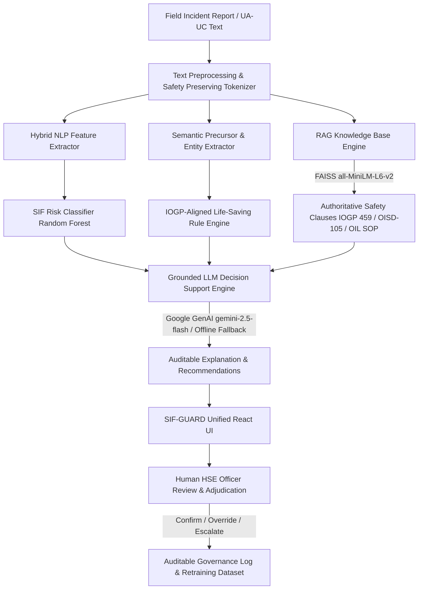

# SIF-GUARD — Explainable Safety Intelligence Platform

> **Smart India Hackathon 2026** | **Problem Statement ID:** SIH26165  
> **Organization:** Oil India Limited (OIL)  
> **Team:** Heisenberg  
> **Repository:** [https://github.com/lgbro16/SIF_GUARD_SIH_26165.git](https://github.com/lgbro16/SIF_GUARD_SIH_26165.git)

---

## 1. Executive Summary & Problem Statement

In upstream oil and gas operations, thousands of safety observations, near-miss incident logs, and unsafe-act/unsafe-condition (UA/UC) reports are filed across drilling rigs, production manifolds, pump stations, and refinery complexes. Historically, high-volume lower-severity incident reports obscure acute precursors to **Serious Injury and Fatality (SIF)** events until a catastrophic failure occurs.

**Problem Statement SIH26165:** Develop an AI/NLP engine capable of detecting SIF precursors from free-text incident descriptions, mapping them against authoritative industry safety standards, providing auditable explanations, and empowering human Health, Safety & Environment (HSE) officers with actionable decision support.

**SIF-GUARD Solution:** SIF-GUARD is an explainable safety intelligence platform featuring:
1. **Hybrid NLP/ML Classifier Baseline:** Leakage-free classification generating an auditable **SIF Risk Score** (0–100%).
2. **Deterministic Factor & Precursor Extraction:** Extracts activities, locations, equipment, hazards, barrier breaches, and potential consequences without hallucination.
3. **IOGP-Aligned Life-Saving Rule (LSR) Mapping:** Matches incidents against standardized critical safety rules.
4. **Authoritative RAG Retrieval:** Dense semantic retrieval (Sentence Transformers + FAISS) querying authentic reference clauses (IOGP 459, OISD-105, OIL H₂S guidelines, and separator cleaning SOPs).
5. **Grounded LLM Explanations:** Bounded decision support powered by Google Gemini (`gemini-2.5-flash`) with an automatic offline grounded fallback.
6. **Human-in-the-Loop (HITL) Adjudication:** Full review queue where qualified HSE officers confirm, override, or escalate AI recommendations to maintain human agency.

---

## 2. System Architecture



---

## 3. Technology Stack

### Frontend Application
* **Framework:** React 19 + Vite 8
* **Styling & Icons:** Tailwind CSS 3.4, Lucide React, Canvas-Confetti
* **Routing & State:** React Router DOM 7, React Context API
* **Target Deployment:** Vercel

### Backend REST API
* **Framework:** Python 3.11+ / Flask 3.1
* **WSGI Production Server:** Gunicorn 21.2
* **CORS & Environment:** Flask-CORS 6.0, python-dotenv
* **Target Deployment:** Render

### AI, Machine Learning & RAG
* **Classical ML:** scikit-learn (Random Forest, TF-IDF Vectorizer), SciPy, NumPy, Pandas
* **Semantic Embeddings:** Sentence Transformers (`all-MiniLM-L6-v2`), PyTorch
* **Vector Index:** FAISS (CPU Inner-Product Cosine Similarity)
* **Generative AI:** Google GenAI SDK (`gemini-2.5-flash`) with deterministic offline template fallback
* **Domain Standards Indexed:** IOGP Report 459, OISD Standard 105, OIL H₂S Safety Guidelines, Separator Vessel Cleaning SOP

---

## 4. Key Platform Features

| Module | Technical Implementation | Purpose |
| :--- | :--- | :--- |
| **AI Analysis Studio** | Hybrid NLP + RAG + LLM | Real-time analysis of free-text incident reports with instant SIF Risk Scoring, precursor extraction, and regulatory citations. |
| **Operational Dashboard** | Aggregate Metrics Engine | High-level visibility into SIF precursor ratios, top barrier failures, active Life-Saving Rules, and facility breakdown. |
| **Review Queue (HITL)** | Audit Persistence Engine (`reviews.json`) | Facilitates human oversight; allows HSE officers to **CONFIRM**, **OVERRIDE**, or **ESCALATE** AI classifications. |
| **Pattern Intelligence** | K-Means + Sentence Transformers | Groups recurring precursor patterns across facilities to uncover latent operational hazards. |
| **Regulatory Evidence Dossier** | Curated Reference Knowledge Base | Full-text view of indexed safety guidelines with clause-level traceability. |

---

## 5. API Reference

The Flask backend exposes the following REST endpoints:

| Method | Endpoint | Description |
| :--- | :--- | :--- |
| `GET` | `/` | API status, health check, and endpoint discovery. |
| `POST` | `/api/analyze` | Primary analysis endpoint; accepts report text and returns complete risk score, extracted entities, LSR matches, RAG evidence, and LLM explanation. |
| `GET` | `/api/analytics` | Returns aggregate statistics derived from the curated 50-report prototype dataset. |
| `GET` | `/api/patterns` | Discovers semantic precursor clusters using Sentence Transformers and K-Means. |
| `GET` | `/api/reviews` | Retrieves all recorded HSE review decisions from the audit trail. |
| `POST` | `/api/reviews` | Persists an HSE officer's adjudication (`CONFIRM`, `OVERRIDE`, `ESCALATE`). |
| `POST` | `/api/jobs` | Submits an asynchronous batch of incident reports for queue processing. |
| `GET` | `/api/jobs/<job_id>` | Checks status and retrieves results of a background batch job. |
| `GET` | `/api/health` | Model governance endpoint returning active embedding model, LLM status, RAG index size, and KB version. |

---

## 6. Local Setup and Execution

### Prerequisites
* **Node.js:** v18+ (Node 20+ recommended)
* **Python:** v3.11 or v3.12 (Git installed)

### 1. Clone Repository
```bash
git clone https://github.com/lgbro16/SIF_GUARD_SIH_26165.git
cd SIF_GUARD_SIH_26165
```

### 2. Backend Setup (Flask REST API)
```bash
cd Backend/SIH26165_ML

# Create and activate virtual environment
python -m venv venv
# On Windows:
venv\Scripts\activate
# On Linux/macOS:
source venv/bin/activate

# Install dependencies
pip install -r requirements.txt

# (Optional) Configure environment variables
copy .env.example .env
# Edit .env to supply GEMINI_API_KEY if desired; offline fallback works automatically

# Run tests
python -m unittest tests/test_pipeline.py
python tests/test_v102_demo.py

# Start Backend Server (runs on http://localhost:5000)
python server.py
```

### 3. Frontend Setup (React + Vite)
```bash
# In a new terminal:
cd Frontend/FRONTEND

# Install dependencies
npm install

# Start Vite Development Server
npm run dev
# Access the web app at http://localhost:5173
```

---

## 7. Cloud Deployment Guide

### Backend Deployment (Render)
1. In the [Render Dashboard](https://dashboard.render.com), click **New > Web Service** and connect the repository: `https://github.com/lgbro16/SIF_GUARD_SIH_26165.git`.
2. Configure settings:
   * **Root Directory:** `Backend/SIH26165_ML`
   * **Environment:** `Python 3`
   * **Build Command:** `pip install -r requirements.txt`
   * **Start Command:** `gunicorn server:app --bind 0.0.0.0:$PORT --timeout 120 --workers 1`
   * **Instance Type:** Free (512MB RAM) or Starter (1GB RAM)
3. Set Environment Variables:
   * `FLASK_ENV`: `production`
   * `CORS_ORIGIN`: `*` (or your deployed Vercel domain)
   * `GEMINI_API_KEY`: *(Optional Google Gemini API Key)*

### Frontend Deployment (Vercel)
1. In the [Vercel Dashboard](https://vercel.com), click **Add New > Project** and import `lgbro16/SIF_GUARD_SIH_26165`.
2. Configure settings:
   * **Framework Preset:** `Vite`
   * **Root Directory:** `Frontend/FRONTEND`
   * **Build Command:** `npm run build`
   * **Output Directory:** `dist`
3. Set Environment Variable:
   * `VITE_API_BASE_URL`: `https://<your-render-service-name>.onrender.com`
4. Deploy. The included `Frontend/FRONTEND/vercel.json` automatically handles SPA client-side routing.

---

## 8. Prototype Limitations & Verification Standards

To uphold technical rigor and SIH integrity:
1. **Curated Prototype Dataset:** The platform operates on a curated 50-report prototype dataset designed to reflect realistic upstream oilfield hazards. It is explicitly demonstration data and **not** actual Oil India Limited operational logs.
2. **Hybrid NLP Baseline:** The classifier is a hybrid NLP/ML baseline combining TF-IDF, domain-engineered safety signals, and a Random Forest estimator. It is not an enterprise fine-tuned Transformer.
3. **Evaluation Metrics:** On the curated prototype dataset, five-fold cross-validation yields a mean SIF recall of **82.7%**. This constitutes preliminary feasibility evidence for screening rather than production performance.
4. **SIF Risk Score:** Scores are reported as an **SIF Risk Score** (0–100%) reflecting relative risk density, not calibrated Bayesian probabilities.
5. **IOGP-Aligned Rule Mapping:** Life-Saving Rule mappings are aligned with the IOGP Report 459 framework but carry no official certification.
6. **Pattern Analytics vs Prediction:** Pattern clusters identify recurring precursor signals across reports; they do not predict future incidents.
7. **Human-in-the-Loop Governance:** AI outputs are strictly designated as **decision support**. The final determination of SIF status remains exclusively with qualified HSE personnel.
